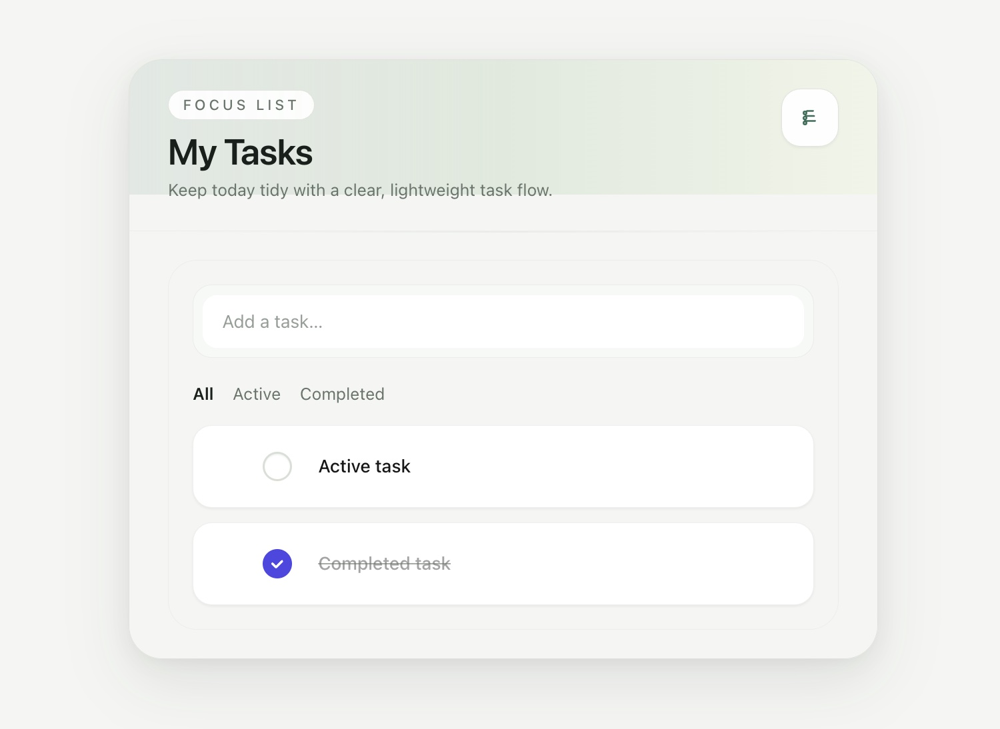

# nf-todo

A minimal, keyboard-friendly personal todo app built as a full-stack engineering demonstration. Single-user, no authentication — runs entirely in Docker.



## Table of Contents

- [Project Overview](#project-overview)
- [Local Setup](#local-setup)
- [Architecture Overview](#architecture-overview)
- [Testing Instructions](#testing-instructions)
- [Deployment](#deployment)

---

## Project Overview

nf-todo is a single-user todo application designed to demonstrate modern full-stack development practices: optimistic UI, repository abstraction, drag-and-drop reordering, tag-based filtering, and a fully containerised local development workflow.

**Tech Stack:**

| Layer          | Technology                                              |
| -------------- | ------------------------------------------------------- |
| Frontend       | React 18, Vite, TypeScript, Tailwind CSS                |
| State          | React Context API + useReducer (optimistic UI)          |
| Routing        | React Router (URL query params for filter state)        |
| Drag & Drop    | @dnd-kit/core + @dnd-kit/sortable                       |
| Backend        | Node.js, Fastify, TypeScript                            |
| Database       | SQLite via better-sqlite3 (synchronous driver)          |
| Infrastructure | Docker (multi-stage builds), docker-compose, nginx      |
| CI             | GitHub Actions (lint, unit, integration, E2E)           |
| E2E Testing    | Playwright (≥ 5 tests, headless Chromium)               |
| Unit Testing   | Vitest + React Testing Library                          |

**Scope:** Local-only development tool. No deployment target, no authentication, no multi-user support.

---

## Local Setup

### Prerequisites

- [Docker Desktop](https://www.docker.com/products/docker-desktop/) (v4.x or later)
- Git

### Quickstart

```bash
git clone https://github.com/your-org/nf-todo.git
cd nf-todo
docker-compose up --build
```

That's it — no additional manual steps required.

### Access

| Service         | URL                                      |
| --------------- | ---------------------------------------- |
| Application     | http://localhost:3000                     |
| Backend health  | http://localhost:4000/api/health          |

---

## Architecture Overview

### Monorepo Structure

```
nf-todo/
├── docker-compose.yml          # Orchestrates both services
├── frontend/                   # React SPA (served by nginx in production)
│   ├── src/
│   │   ├── api/todos.ts        # API client (fetch wrappers)
│   │   ├── components/         # React components (one per file)
│   │   ├── context/            # TodoContext + ToastContext
│   │   ├── hooks/              # Custom hooks (useTagFilter)
│   │   ├── types/todo.ts       # Shared TypeScript interfaces
│   │   └── utils/              # cn(), parseTagsFromTitle()
│   ├── e2e/                    # Playwright E2E tests
│   └── playwright.config.ts
├── backend/                    # Fastify REST API
│   └── src/
│       ├── routes/todos.ts     # CRUD + reorder endpoints
│       ├── repository/         # ITodoRepository + SqliteTodoRepository
│       ├── plugins/cors.ts     # CORS configuration
│       └── server.ts           # App bootstrap
└── _bmad-output/               # Planning and implementation artifacts
```

### Communication Pattern

The frontend is a React SPA served as static files by nginx (port 3000). It makes HTTP REST calls to the Fastify backend (port 4000) for all data operations.

```
Browser → nginx (:3000) → static React SPA
              ↓ fetch()
         Fastify API (:4000) → SQLite (/data/todos.db)
```

### Key Architecture Decisions

- **Repository abstraction:** Route handlers only interact with `ITodoRepository` — never `better-sqlite3` directly. This isolates data access and simplifies testing.
- **State management:** React Context API + `useReducer`. No Redux or Zustand.
- **Optimistic UI:** All mutations update the UI immediately before the API responds. On failure, state rolls back and a toast notification appears.
- **Filter state:** Status and tag filters live exclusively in URL query params (`?status=active&tags=work`) via React Router's `useSearchParams`.
- **Data persistence:** SQLite file at `/data/todos.db` inside a named Docker volume (`backend_data`). Data survives container restarts.

---

## Testing Instructions

### Unit & Integration Tests

```bash
# Frontend (Vitest + React Testing Library)
cd frontend && npm test

# Backend (Vitest)
cd backend && npm test
```

### Coverage Reports

```bash
# Generate coverage report (either directory)
npm run test:coverage
```

Coverage threshold: **≥ 70%** enforced by Vitest. CI fails if coverage drops below this.

### E2E Tests (Playwright)

E2E tests run against the fully built Docker stack:

```bash
# 1. Start the app
docker-compose up --build -d

# 2. Install Playwright browsers (first time only)
cd frontend && npx playwright install chromium

# 3. Run E2E tests
npm run test:e2e

# 4. View HTML report (optional)
npx playwright show-report
```

The suite covers: create todo, complete todo, delete todo, drag-to-reorder, and filter by status.

### CI

GitHub Actions runs all tests automatically on every push to `main`:
1. **Lint** — ESLint across both services
2. **Unit + Integration** — Vitest with coverage enforcement
3. **E2E** — Playwright against `docker-compose up` stack

A failing test blocks the merge.

---

## Deployment

### Starting the System

```bash
docker-compose up --build
```

This builds and starts two containers:

| Container   | Description                                          | Host Port |
| ----------- | ---------------------------------------------------- | --------- |
| `frontend`  | Vite build → nginx serving static files              | 3000      |
| `backend`   | TypeScript compile → Node.js Fastify REST API        | 4000      |

The frontend container waits for the backend health check to pass before starting.

### Health Verification

```bash
curl http://localhost:4000/api/health
# → {"status":"ok"}
```

### Data Persistence

The named volume `backend_data` stores the SQLite database. Data survives `docker-compose down`.

To **wipe all data** and start fresh:

```bash
docker-compose down -v
```

### Stopping

```bash
docker-compose down
```
