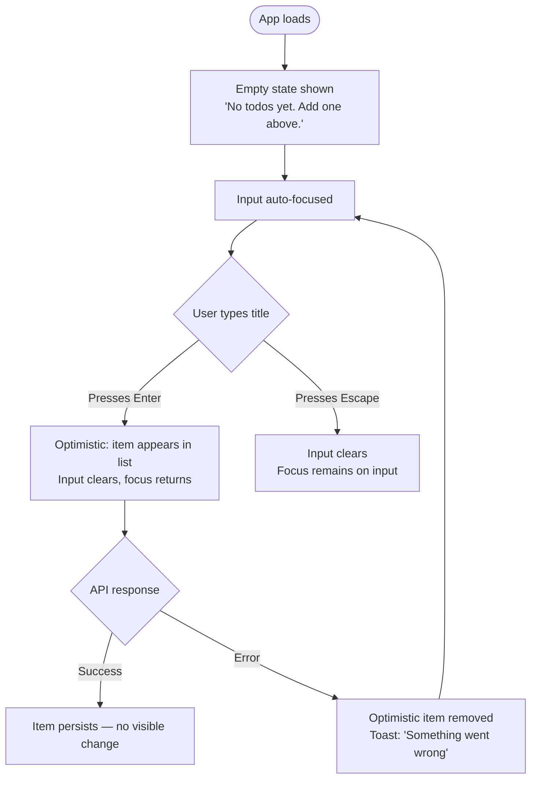
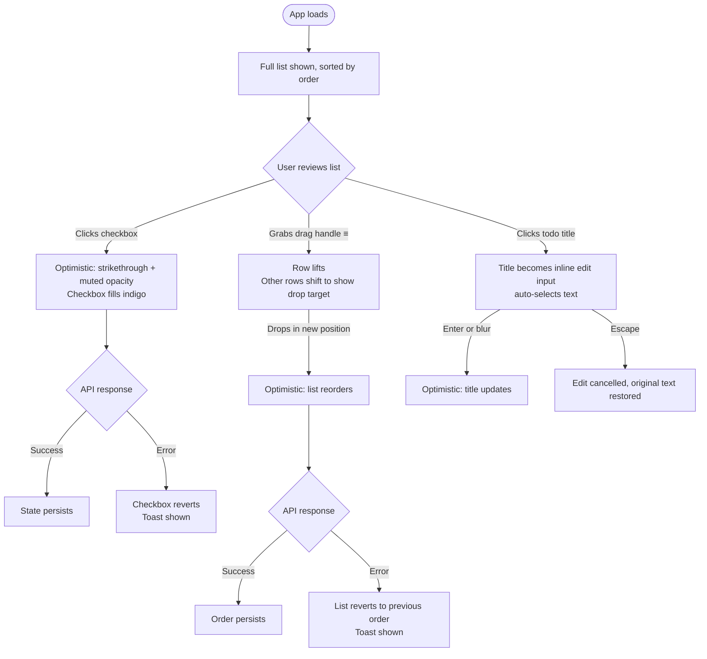
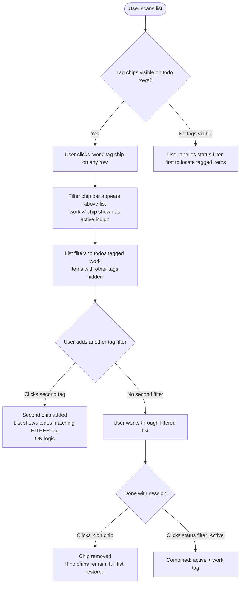
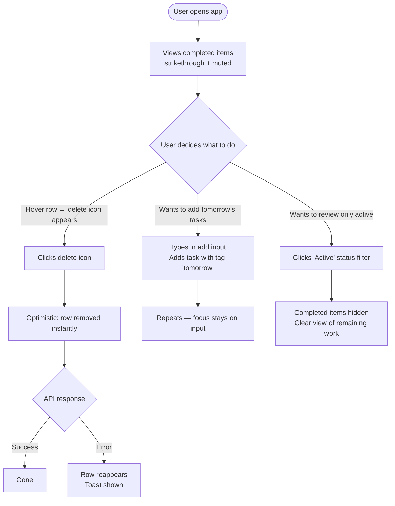

# UX Design Specification nf-todo

**Author:** Sameer
**Date:** 2026-03-29

---

<!-- UX design content will be appended sequentially through collaborative workflow steps -->

## Executive Summary

### Project Vision

nf-todo is a single-user personal task manager with a clean, focused interface. The application supports the full lifecycle of a task: creation, editing, completion, tagging, filtering, reordering, and deletion — all persisted to a SQLite database via a Fastify REST API. There is no authentication, no collaboration, and no unnecessary chrome. Every UX decision optimises for a single person moving quickly through their task list.

### Target Users

**Primary (and only) user:** A single individual managing personal tasks on their own device. No concurrent users, no shared data, no roles. The user is self-sufficient — they do not need onboarding flows, confirmations, or safety rails beyond what reasonable defaults provide. They interact via a pointer device (mouse or touch) on desktop or mobile viewports.

### Key Design Challenges

1. **Composable filters with clear state:** Status filter and tag filter operate simultaneously. The solution is a visible active-filter bar showing independently dismissable chips (e.g. "Active · work ×") above the list. The user always knows what lens they are looking through and can clear any single filter without resetting all state.
2. **Edit vs. drag affordance on the same list item:** Inline editing and drag-and-drop both originate from direct interaction with a todo row. An explicit drag handle icon (≡) on the left of each row resolves the conflict: grab the handle to drag; click anywhere else on the row to edit. The handle doubles as a visual anchor that makes the list feel structured.
3. **Empty state vs. no-results state:** Two distinct zero-item scenarios require clearly different messaging. True empty: "No todos yet" (the list is genuinely empty). Filtered empty: "No todos match your filters" with a "Clear filters" action (filters are active but match nothing). A blank screen for either case reads as broken.

### Design Opportunities

1. **Zero auth/collaboration overhead:** The UI can be entirely task-list-centric — no nav, no user menus, no permission states. Maximum focus on the list itself.
2. **Tag UX:** Freeform tag input with removable chip/badge display offers a chance for a smooth micro-interaction pattern that feels lightweight but capable.
3. **Error toast:** The toast is pre-decided (bottom-right, auto-dismiss on 5xx) — the opportunity is in making it feel calm and informative rather than alarming.

## Core User Experience

### Defining Experience

The core loop is: open → scan the list → act. The most frequent action is completing a todo (checkbox toggle) — it must be instant, require a single pointer event, and feel satisfying. Adding a new todo is the second most frequent action; the input field must be visually prominent on load with focus ready. All other interactions (edit, tag, reorder, filter) are secondary to this central loop.

### Platform Strategy

- **Platform:** Web SPA, responsive layout via Tailwind CSS
- **Viewport:** Single-page application — the entire experience lives on one screen with no page navigation
- **Input:** Pointer-based (mouse and touch pointer events). Keyboard is supported for text input and form submission (Enter to save); drag-and-drop is pointer-only
- **Responsive:** Desktop-primary; mobile-capable via Tailwind responsive breakpoints. No minimum viewport enforced
- **Offline:** Not required — the app communicates with a local Fastify REST API via Docker

### Effortless Interactions

The following interactions must require zero cognitive effort:

- **Add todo:** Type in the input field at the top → press Enter → item appears at bottom of list, focus returns to input immediately
- **Complete todo:** Single click/tap on checkbox → item visually shifts to a completed state (strikethrough + muted colour) instantly
- **Inline edit:** Single click on a todo title → title becomes editable in place → Enter or blur saves, Escape cancels
- **Delete todo:** Click/tap the delete control → item is removed immediately, no confirmation dialog
- **Drag reorder:** Press and hold the drag handle (≡) → drag to new position → release → list reorders and persists

### Critical Success Moments

1. **First 5 seconds:** The add-todo input is immediately visible and focused on load. The user can create their first task without scrolling or searching for a button.
2. **First completion:** Checking off a task delivers an instant visual state change — the user feels the list is responding to them.
3. **First tag:** Adding a tag to a todo produces a visible chip/badge inline — the user immediately understands the tag model without instruction.
4. **Filter discovery:** Selecting a status filter or tag chip produces an immediate, obvious list change with the active filter state displayed above the list.
5. **Container restart:** All todos, order, and tags survive a fresh `docker-compose up` — persistence is invisible and assumed.

### Experience Principles

1. **Act first, confirm never:** Destructive actions (delete, tag remove) execute immediately. The user's intent is trusted. No confirmation dialogs.
2. **Always show what's active:** Filter state is always visible. The user never has to wonder why the list is showing fewer items.
3. **The list is the UI:** No nav, no sidebars, no modals. The task list is the entire application. Every pixel serves the list.
4. **Errors are guests, not hosts:** A 5xx error is shown as a calm toast that auto-dismisses. The user's data and workflow are never blocked by an error state.

## Desired Emotional Response

### Primary Emotional Goals

The dominant emotional target for nf-todo is **relief** — the app is a trusted externalisation of the user's mental load. Adding a task should feel like setting something down. Completing one should feel like a small, satisfying reward.

Supporting emotion: **in control** — the list reflects the user's intent at all times. Order, filter state, and completion state are always predictable.

### Emotional Journey Mapping

| Moment | Target Feeling |
|---|---|
| First load | Calm readiness — input is prominent, nothing obstructs |
| Adding a todo | Release — the thought is out of the user's head and into the list |
| Completing a todo | Satisfaction — a visible state change rewards the action |
| Inline editing | Fluency — the experience feels direct, not mediated |
| Drag reorder | Agency — the user controls the order, and it stays |
| Tag filter active | Focus — the list narrows to exactly what the user chose |
| API error (toast) | Mild awareness — something hiccuped, but the list is intact |
| Container restart | Trust — everything persists exactly as it was left |

### Micro-Emotions

- **Confidence, not confusion:** The user always knows what state the app is in (active filters, saved edits, persisted order)
- **Trust, not anxiety:** No data is silently lost; errors are surfaced calmly without disrupting the workflow
- **Accomplishment, not friction:** Completing, editing, and deleting are immediate and direct — no dialogs, no confirmation loops

### Design Implications

- **Relief → minimal interface:** No visual noise, no chrome. The list is the UI. White space and clear typography support mental calm.
- **Satisfaction → completing a todo:** The checkbox toggle must have a distinct visual state (strikethrough, muted colour, or opacity change) that communicates "done" clearly.
- **Trust → persistence signals:** The app should never show a stale or loading state after a successful action. Optimistic UI updates support the feeling that the system is responsive and reliable.
- **Calm awareness → error toast:** The error toast is neutral in colour (not red/alarming), informative in copy ("Something went wrong"), and auto-dismisses. It informs without alarming.

### Emotional Design Principles

1. **The list is the reward:** A clean, organised, filterable list is the entire product value. Design every element to make the list feel satisfying to look at and interact with.
2. **Invisible persistence:** The user should never have to think about whether their changes saved. State changes must feel instant and permanent.
3. **Errors whisper, they don't shout:** Error states are non-disruptive by design. The user's workflow continues uninterrupted.

## UX Pattern Analysis & Inspiration

### Inspiring Products Analysis

- **Things 3** — Extreme visual calm; muted completed-state styling (strikethrough + reduced opacity) de-emphasises done items without removing them from view. Completion feels rewarding but not theatrical.
- **Linear** — Optimistic UI throughout; state updates are applied instantly without waiting for API confirmation. Active filter chips are always visible and individually dismissable above the list.
- **Todoist** — Top-anchored add input with inline task creation (type + Enter); tags rendered as coloured chips inline with the task title; clean visual separation between input and list.
- **Apple Reminders** — Explicit drag handle (≡) as the sole drag affordance; single click to edit inline; no modals for any common operation.

### Transferable UX Patterns

| Pattern | Source | Application in nf-todo |
|---|---|---|
| Optimistic UI updates | Linear | All CRUD actions update the UI immediately; reconcile on API error via toast |
| Active filter chip bar | Linear | Visible filter state bar above the todo list showing dismissable chips |
| Muted completed-item styling | Things 3 | Completed todos: strikethrough title + reduced text opacity |
| Explicit drag handle (≡) | Apple Reminders | Left edge of each todo row; ≥44px touch target on mobile |
| Top-anchored add input | Todoist | Persistent input field at top of list, auto-focused on app load |
| Inline tag chips | Todoist | Tags rendered as small badges/chips on each todo row, removable with × |

### Anti-Patterns to Avoid

| Anti-Pattern | Reason to Avoid |
|---|---|
| Confirmation dialogs for delete | Breaks flow; immediate delete is a resolved design decision |
| Full-page modal for editing | Violates “the list is the UI” — editing must happen inline |
| Inline save/cancel buttons during edit | Adds friction; Enter or blur to save, Escape to cancel is sufficient |
| Red/alarming error styling for toast | Conflicts with “errors whisper, they don’t shout” emotional principle |
| Dropdown menus for tag filtering | OR-logic tag filter is best served by toggleable chips, not a dropdown |
| Loading spinners on every action | Optimistic UI means state updates appear instant; spinners only on initial load if needed |

### Design Inspiration Strategy

**Adopt directly:**
- Optimistic UI pattern for all mutations (create, complete, edit, delete, reorder)
- Active filter chip bar with individual dismiss (Linear pattern)
- Muted/strikethrough completed state (Things 3 pattern)
- Explicit left-edge drag handle (Apple Reminders pattern)

**Adapt:**
- Todoist’s top-anchored input — simplified to a single plain text input with Enter-to-submit; no priority pickers or date fields
- Todoist’s tag chips — adapted to freeform text entry with chips displayed inline; no predefined colour palette required

**Avoid entirely:**
- Any modal, drawer, or overlay for common task operations
- Any synchronous “are you sure?” patterns
- Any alarming visual treatment for error states

## Design System Foundation

### Design System Choice

**Tailwind CSS utility-first** — no third-party component library. All UI components are built directly from Tailwind utility classes in React. This is the design system approach for nf-todo.

### Rationale for Selection

- **Already in the stack:** Tailwind CSS is a confirmed PRD requirement; no decision needed at the library level
- **Scope fits utilities:** The entire UI is a single-screen task list. The component count is small (todo row, checkbox, inline input, tag chip, filter chip bar, toast). None require a library.
- **Solo developer:** No component library means no version mismatch, no upstream API changes, no tree-shaking complexity. Tailwind utilities + React components are the entire dependency.
- **Visual control:** Tailwind’s utility classes give direct, predictable styling with no specificity battles or overrides of library defaults.
- **Bundle size:** No component library import means a smaller production bundle served by nginx.

### Implementation Approach

- **Tailwind configuration:** Extend the default theme sparingly — define a small colour palette (neutral greys, one accent colour for active states/chips) and a `font-family` override if desired. No drastic theme overrides.
- **Component pattern:** Each logical UI unit is a React component that composes Tailwind classes. No CSS modules, no styled-components, no global stylesheets beyond Tailwind’s base reset.
- **Responsive strategy:** Use Tailwind’s `sm:` and `md:` prefixes. The layout is a single centred column, so responsive changes are minimal.
- **Dark mode:** Out of scope for v1. No `dark:` variants needed.

### Customization Strategy

The following custom components will be built from Tailwind primitives:

| Component | Key Tailwind patterns |
|---|---|
| `TodoItem` | `flex`, `gap`, `group`, `hover:` states, strikethrough on complete |
| `Checkbox` | Custom styled `<input type="checkbox">` with `accent-color` or SVG icon |
| `InlineEditInput` | `border-none focus:ring` input that appears on click, invisible at rest |
| `TagChip` | `rounded-full px-2 py-0.5 text-xs bg-neutral-100` with `×` button |
| `FilterChipBar` | `flex flex-wrap gap-2` row of toggleable chips above the list |
| `Toast` | `fixed bottom-4 right-4 rounded shadow-md` with fade-out animation |
| `DragHandle` | `cursor-grab` icon (≡) with `opacity-0 group-hover:opacity-100` |
| `EmptyState` | Centred flex container with muted copy |

---

## Defining Core Experience

### Defining Experience

**The defining interaction:** *Type a task title → press Enter → it appears in the list instantly.*

Every other feature (tags, filters, reorder, complete) is secondary to this core loop. If adding a task feels instant, reliable, and frictionless, the app succeeds. If it doesn't, everything else is irrelevant.

### User Mental Model

Users arrive with a pre-formed mental model from sticky notes, notepad apps, and existing todo tools: type → submit → it's there. nf-todo does not need to teach users a new pattern. It needs to be the cleanest, fastest execution of the model they already hold.

**What frustrates users in existing solutions:**
- Modal or form that must be submitted before the item appears
- Focus lost after submit — requires re-click to add the next item
- Newly added item not immediately visible (scrolled off screen)
- Required fields beyond the title

### Success Criteria

The core experience succeeds when:
- A user can add 5 tasks in under 10 seconds without lifting their hands from the keyboard
- Focus returns to the input field immediately after Enter — no re-click needed
- The new item is visible in the list without scrolling
- The input field clears and is ready for the next entry

### Novel vs. Established Patterns

This is a fully established pattern — no user education required. The interaction is identical to every successful todo app the user has previously used. The differentiation is in execution quality (speed, focus management, optimistic update) not in pattern novelty.

### Experience Mechanics

**1. Initiation**
- On app load, the add-todo input is visible at the top of the main content area
- Input receives focus automatically on load (no click required to start typing)

**2. Interaction**
- User types a task title in the input field
- User presses Enter to submit
- The system appends the new todo to the bottom of the list (preserving manual order; drag reorder is the mechanism for changing priority)
- Alternatively: pressing Escape clears the input without submitting

**3. Feedback**
- Optimistic UI: the item appears in the list immediately before API confirmation
- Input field clears and focus returns to it — ready for the next task
- If the API call fails: the optimistic item is removed and a toast is shown ("Something went wrong")

**4. Completion**
- The todo is visible at the bottom of the list (or at the bottom of the current filter set if filters are active)
- No confirmation, no modal, no redirect — the user is already positioned to add the next task

---

## Visual Design Foundation

### Color System

**Strategy:** A neutral-dominant palette with a single indigo accent. Neutral grays carry 95% of the UI; indigo is reserved for interactive affordances and active states only. This keeps the interface visually quiet — supporting the "calm and in control" emotional goals — while giving users clear signal on what's clickable.

| Role | Tailwind token | Hex | Usage |
|---|---|---|---|
| Page background | `bg-white` | #ffffff | App root |
| Surface / row | `bg-white` | #ffffff | Todo rows, input |
| Subtle surface | `bg-neutral-50` | #fafafa | Hover row bg, chip bg |
| Border default | `border-neutral-200` | #e5e5e5 | Row dividers, input border |
| Border focus | `ring-indigo-500` | #6366f1 | Keyboard focus ring |
| Text primary | `text-neutral-900` | #171717 | Todo titles, headings |
| Text secondary | `text-neutral-500` | #737373 | Timestamps, labels |
| Text muted | `text-neutral-400` | #a3a3a3 | Completed todo title, placeholders |
| Accent / interactive | `text-indigo-600` | #4f46e5 | Active filter chips, checkbox checked state |
| Accent background | `bg-indigo-50` | #eef2ff | Active chip background |
| Accent hover | `bg-indigo-100` | #e0e7ff | Chip hover |
| Destructive (hover only) | `text-rose-500` | #f43f5e | Delete icon on hover |
| Completed strikethrough | `line-through text-neutral-400` | — | Completed todo text |

**Accessibility:** All text/background pairs meet WCAG AA. `neutral-900` on `white` = 15.3:1 (AAA). `indigo-600` on `white` = 5.9:1 (AA). `neutral-500` on `white` = 5.9:1 (AA).

### Typography System

**Font:** Inter (Google Fonts) — the canonical modern web UI typeface. Excellent legibility at small sizes, neutral character, and extensive weight range.

**Tone:** Professional and calm, not decorative. No display fonts. The UI communicates through clarity of structure, not typographic personality.

| Element | Tailwind classes | Notes |
|---|---|---|
| App title / page heading | `text-xl font-semibold text-neutral-900` | Single instance |
| Todo title (active) | `text-[15px] font-normal text-neutral-900` | 15px — more readable than `text-sm` at rest |
| Todo title (completed) | `text-[15px] font-normal text-neutral-400 line-through` | |
| Input placeholder | `text-[15px] text-neutral-400` | Matches todo title size |
| Tag chip label | `text-xs font-medium text-neutral-600` | |
| Filter chip label | `text-xs font-medium` | Indigo when active, neutral-600 when inactive |
| Empty state copy | `text-sm text-neutral-400` | Centred, lowercase tone |
| Toast message | `text-sm text-neutral-700` | |
| Count / meta | `text-xs text-neutral-400` | e.g. "3 items left" |

**Line height:** `leading-normal` (1.5) for body text; `leading-tight` (1.25) for single-line UI labels.

**Font loading:** `<link>` preconnect + Inter variable font (`wght@100..900`) in `index.html`. Apply globally via Tailwind `fontFamily` config: `fontFamily: { sans: ['Inter', 'sans-serif'] }`.

### Spacing & Layout Foundation

**Base unit:** 4px (Tailwind default). All spacing is multiples of 4px.

**Content strategy:** Single-column, centred. nf-todo has no sidebar, no nav, no secondary panels. The entire app lives in one column.

| Element | Value | Tailwind |
|---|---|---|
| Page max-width | 672px | `max-w-2xl` |
| Page horizontal padding | 16px | `px-4` |
| Page top padding | 48px | `pt-12` |
| Add-input bottom margin | 16px | `mb-4` |
| Todo row padding | 12px 16px | `py-3 px-4` |
| Gap between todo rows | 1px (border) | `divide-y divide-neutral-100` |
| Filter chip bar gap | 8px | `gap-2` |
| Tag chip padding | 4px 8px | `py-1 px-2` |
| Drag handle touch target | ≥44px | `w-11 flex items-center justify-center` |
| Toast offset | 16px from corner | `bottom-4 right-4` |

**Layout approach:** `min-h-screen bg-white` root. Content centred with `mx-auto max-w-2xl px-4`. No grid — purely vertical stacking with `flex flex-col gap`.

### Accessibility Considerations

- **Focus visible:** All interactive elements use `focus-visible:ring-2 focus-visible:ring-indigo-500 focus-visible:ring-offset-2`. Never remove outlines without replacement.
- **Colour independence:** Active filter chip communicates state through both colour change AND `font-semibold` weight change, not colour alone.
- **Touch targets:** All interactive elements ≥44×44px (WCAG 2.5.5 AAA). Drag handle, checkbox, delete icon all meet this threshold.
- **Reduced motion:** Transitions gated behind `motion-safe:transition-opacity` — users with `prefers-reduced-motion` receive no animation.
- **Contrast:** All foreground/background pairs validated at AA minimum. `neutral-400` on `white` (4.5:1) used only for non-essential decorative text (completed items, placeholders).

---

## Design Direction Decision

### Design Directions Explored

Six directions were explored across the spectrum of visual density and structural approach:

| # | Name | Key Character |
|---|---|---|
| 1 | Editorial | Full whitespace, borderless input, divider-only rows |
| 2 | Card List | Subtle card shadow per row, animated entry |
| 3 | Dense / Terminal | Compact rows, always-visible filter shelf, power-user feel |
| 4 | Floating Input | Sticky add bar, inline tag parsing |
| 5 | Sidebar Filter | Two-column layout, vertical filter panel |
| 6 | Minimal / Zen | Icon-only toolbar, progressive disclosure, distraction-free |

### Chosen Direction

**Direction 1 — "Editorial"**

- Page title: small, left-aligned, `text-sm font-semibold text-neutral-400` — present but quiet
- Add input: full-width, borderless body, bottom border only (`border-b border-neutral-200`), placeholder "Add a task…"
- Todo list: no cards, no shadows — `divide-y divide-neutral-100`; the row *is* the item
- Checkbox: left of title, `rounded-sm border-neutral-300`, filled indigo when checked
- Filter chips: flush below input, `text-xs`, minimal visual weight
- Drag handles: `opacity-0 group-hover:opacity-100`, do not contribute to visual noise at rest
- Delete: `opacity-0 group-hover:opacity-100`, appears on row hover only

### Design Rationale

Direction 1 is the strongest match for nf-todo's established principles:

- **"The list is the UI"** — no chrome competes with the list content
- **Calm and relief** — whitespace communicates that nothing is urgent or overwhelming
- **Execution quality over novelty** — the pattern is invisible; users notice only speed
- **Tailwind utility-first** — divider-row layout requires the fewest custom overrides; `divide-y` does the work

### Implementation Approach

- Root: `min-h-screen bg-white font-sans`
- Content area: `mx-auto max-w-2xl px-4 pt-12`
- Add input container: `border-b border-neutral-200 pb-3 mb-4`
- Input element: `w-full outline-none text-[15px] text-neutral-900 placeholder:text-neutral-400`
- Todo list: `divide-y divide-neutral-100`
- Each row: `flex items-center gap-3 py-3 px-0 group`
- Progressive disclosure (drag handle, delete): `opacity-0 group-hover:opacity-100 transition-opacity motion-safe:transition-opacity`

---

## User Journey Flows

### Journey 1: First Visit — Add First Task

**Entry point:** User opens app for the first time. No todos exist.

**Flow optimisations:**
- Empty state copy is non-instructional — the focused input speaks for itself
- Focus is on input at app load — no click required
- After a successful add, the user is instantly ready to add the next task

### Journey 2: Daily Review — Complete and Organise

**Entry point:** User opens app with an existing list of todos, default "All" filter.

### Journey 3: Focus Session — Filter by Tag

**Entry point:** User wants to see only tasks tagged "work".

**Flow optimisations:**
- OR logic between tag chips keeps the list usable — AND logic would produce empty results too easily
- The chip bar only appears when ≥1 filter is active — no persistent UI noise

### Journey 4: End of Day — Bulk Triage

**Entry point:** User wants to clean up the list — delete done items, add tomorrow's tasks.

### Journey Patterns

| Pattern | Description | Applied in |
|---|---|---|
| Optimistic-first | UI updates before API confirmation; reverts on error | All CRUD mutations |
| Progressive disclosure | Destructive/drag affordances hidden until hover | Delete, drag handle |
| Focus retention | After submit/complete, focus returns to logical next action | Add input post-Enter |
| Filter as lens | Filters never delete data — they change what's visible | Tag chips, status filter |
| OR accumulation | Multiple active filters broaden, never narrow to zero | Tag chip bar |

### Flow Optimisation Principles

1. **Minimise steps to value** — most journeys reach their goal in ≤2 interactions
2. **Never lose the user's place** — filter state, scroll position, and input focus are preserved across operations
3. **Error recovery is local** — a failed API call reverts only the affected item; the rest of the list is unaffected
4. **No dead ends** — every empty or filtered state offers a clear next action (input visible, "Clear filters" link present)

---

## Component Strategy

### Design System Components

The design system is **Tailwind CSS utilities only** — no pre-built component library is imported. Tailwind provides all layout, state, typography, and colour primitives. Every component below is purpose-built from these utilities.

Shared utility:
- `cn()` helper (clsx + tailwind-merge) for conditional class composition
- `tailwind.config.js` extended with `fontFamily: { sans: ['Inter', 'sans-serif'] }`

### Custom Components

#### `AddTodoInput`
**Purpose:** Primary task creation entry point — always visible, always focused on load.
**Anatomy:** `<form>` wrapping a single `<input type="text">`, container has bottom border only.
**States:** Default (placeholder visible), Filled (text neutral-900), Submitting (briefly disabled).
**Behaviour:** Enter submits; Escape clears; auto-focused on mount via `useEffect + ref.focus()`.
**Tailwind:** `w-full outline-none text-[15px] text-neutral-900 placeholder:text-neutral-400 bg-transparent`
**Container:** `border-b border-neutral-200 pb-3 mb-4`

#### `TodoItem`
**Purpose:** Single todo row — the primary unit of the UI.
**Anatomy:** `flex items-center gap-3 py-3 group` containing: DragHandle │ Checkbox │ Title/InlineEditInput │ TagList │ DeleteButton.
**States:** Default (white), Hovered (`bg-neutral-50`), Dragging (`shadow-md opacity-75 bg-white`), Completed (title `line-through text-neutral-400`), Editing (InlineEditInput replaces title).
**Keyboard:** Tab navigates into row; Enter on title activates inline edit; Space on checkbox toggles.

#### `Checkbox`
**Purpose:** Toggle todo completed state.
**Anatomy:** `<button role="checkbox">` (not native `<input>`) for full style control.
**States:** Unchecked (`rounded-sm border border-neutral-300 w-4 h-4`), Checked (`bg-indigo-600 border-indigo-600` + SVG checkmark), Hover (`border-indigo-400`).
**Accessibility:** `aria-checked`, `aria-label="Mark complete"`.

#### `InlineEditInput`
**Purpose:** Inline title editing activated by single click on todo title.
**Anatomy:** `<input type="text">` replacing title span; invisible borders at rest, ring-1 on focus.
**States:** Idle (invisible, renders like text) → Active (`focus:ring-1 focus:ring-indigo-300`).
**Behaviour:** Enter or blur saves; Escape cancels and restores original. `onBlur` debounced to avoid Escape key race.
**Tailwind:** `w-full bg-transparent outline-none focus:ring-1 focus:ring-indigo-300 rounded px-1 text-[15px] text-neutral-900`

#### `TagChip` (on TodoItem)
**Purpose:** Display tags on a todo row; clickable to activate tag filter.
**States:** Default (`bg-neutral-100 text-neutral-600`), Hover (`bg-neutral-200`), Active/filtering (`bg-indigo-50 text-indigo-700 ring-1 ring-indigo-200`).
**Tailwind:** `rounded-full px-2 py-0.5 text-xs font-medium`

#### `DragHandle`
**Purpose:** Explicit drag affordance (≡ icon) — left edge of row.
**States:** `opacity-0 group-hover:opacity-100 cursor-grab active:cursor-grabbing`.
**Accessibility:** `aria-label="Drag to reorder"`. @dnd-kit keyboard sensor provides keyboard DnD separately.
**Touch target:** `w-11 h-full flex items-center justify-center` (≥44px).

#### `DeleteButton`
**Purpose:** Permanently delete a todo — no confirmation dialog.
**States:** `opacity-0 group-hover:opacity-100 text-neutral-400 hover:text-rose-500`.
**Accessibility:** `aria-label="Delete todo"`.

#### `FilterChipBar`
**Purpose:** Shows active filters as dismissible chips; rendered only when ≥1 filter is active.
**Anatomy:** `flex flex-wrap gap-2` row of `FilterActiveChip` items + "Clear all" link.
**States:** Hidden when no filters; enters with `motion-safe:animate-in fade-in`.

#### `FilterActiveChip`
**Purpose:** Represents a single active filter (status or tag); dismissible with ×.
**States:** Default (`bg-indigo-50 text-indigo-700 ring-1 ring-indigo-200`), Hover (`bg-indigo-100`), Dismiss hover (`× text-indigo-400`).

#### `StatusFilterBar`
**Purpose:** Switch between All / Active / Completed views.
**Anatomy:** Three `<button>` tabs in a row above the list.
**States:** Active tab: `font-semibold text-neutral-900`; Inactive: `text-neutral-400 hover:text-neutral-600`.
**Behaviour:** Mutually exclusive; state persisted in URL query param or local component state.

#### `EmptyState`
**Purpose:** Contextual empty state — two distinct variants.
**Variants:**
- **No todos:** `"No todos yet."` — first visit or after all items deleted
- **No results:** `"No todos match your filters."` + Clear filters `<button>`
**Tailwind:** `flex flex-col items-center justify-center py-16 text-neutral-400 text-sm`

#### `Toast`
**Purpose:** Non-blocking error notification for 5xx API failures only.
**Anatomy:** `fixed bottom-4 right-4 z-50 rounded-lg shadow-md px-4 py-3 bg-white border border-neutral-200 text-sm text-neutral-700`.
**States:** Enters with `motion-safe:animate-in slide-in-from-bottom-2 fade-in`; auto-dismisses after 4 seconds.
**Accessibility:** `role="status" aria-live="polite"`.

### Component Implementation Strategy

- All components co-located in `src/components/`
- No global component registry — import directly at point of use
- Shared Tailwind patterns consolidated in `tailwind.config.js` custom tokens where repeated (e.g. chip pill base)
- No CSS modules — Tailwind utilities only; `cn()` (clsx + tailwind-merge) for conditional composition
- @dnd-kit manages all DnD state; `TodoItem` receives `isDragging` prop from `useSortable`

### Implementation Roadmap

| Phase | Components | Critical for |
|---|---|---|
| 1 — Core | `AddTodoInput`, `TodoItem`, `Checkbox`, `EmptyState` | Add + display + complete loop |
| 2 — Filtering | `FilterChipBar`, `FilterActiveChip`, `StatusFilterBar`, `TagChip` | Discovery and focus journeys |
| 3 — Edit & Delete | `InlineEditInput`, `DeleteButton` | Complete CRUD |
| 4 — DnD | `DragHandle` + @dnd-kit wiring | Reorder journey |
| 5 — Feedback | `Toast` | Error recovery |

---

## UX Consistency Patterns

### Action Hierarchy

nf-todo has no modal dialogs, no multi-step forms, and no secondary navigation. The traditional button hierarchy collapses to a simpler model:

| Level | Appearance | Examples |
|---|---|---|
| **Implicit action** | No button — Enter key, click, drag | Add task (Enter), check off (click), reorder (drag) |
| **Passive action** | Text link/button, `text-sm text-neutral-500 hover:text-neutral-700` | "Clear filters", "Clear all" |
| **Destructive action** | Icon button, `text-neutral-400 hover:text-rose-500`, hover-revealed only | Delete todo |

**Rules:**
- No filled primary buttons anywhere — actions are implicit or passive
- Destructive actions are always hidden until hover; never the most prominent element
- No confirmation dialogs — optimistic revert on error serves as implicit undo

### Feedback Patterns

| Situation | Pattern | Notes |
|---|---|---|
| Successful CRUD | No feedback | Optimistic UI; success is the item appearing/changing |
| API error (5xx) | Toast, neutral colour, auto-dismiss 4s | `role="status" aria-live="polite"` |
| Client validation (empty title) | Prevent submit silently; input `motion-safe:animate-shake` | No red error text — block the action |
| Loading state | None | All mutations are optimistic; no spinner needed |
| Drag in progress | Row lifts: `shadow-md opacity-75`; drop zone: faint divider highlight | @dnd-kit handles most |

**Rules:**
- Positive feedback is the interaction itself
- Negative feedback is minimal and non-blocking
- No loading spinners — latency masked by optimistic UI

### Form Patterns

| Rule | Detail |
|---|---|
| Single field only | No labels, helper text, or required markers |
| Submit on Enter | No submit button visible |
| Cancel on Escape | Clears / reverts without saving |
| No empty submit | Empty input → prevent submit silently |
| Focus management | After submit: focus returns to input. After cancel: focus returns to input. |
| Blur on add input | Clears input (user may have clicked away accidentally) |
| Blur on inline edit | Saves (user clicked away intentionally) — `onBlur` debounced vs Escape |

### Navigation Patterns

nf-todo has no routes or breadcrumbs. "Navigation" is filter-based state only:

| Pattern | Behaviour |
|---|---|
| Status filter | Mutually exclusive tab (All / Active / Completed) |
| Tag filter | Additive OR-logic chip selection |
| Combined filters | Status + tag both apply; both must match |
| Filter persistence | URL query params (`?status=active&tags=work`) for back button / shareable links |
| Reset | "Clear all" resets all filters to default |

### Empty & Loading States

| State | Message | Action offered |
|---|---|---|
| No todos | `"No todos yet."` | None — input visible above |
| No results (active filters) | `"No todos match your filters."` | `"Clear filters"` inline link |
| Initial load | 3 skeleton rows: `h-10 bg-neutral-100 rounded animate-pulse` | None |

### Interaction Patterns

| Pattern | Rule |
|---|---|
| Hover reveal | Drag handle + delete hidden at `opacity-0`; `group-hover:opacity-100`. On touch: always visible at reduced opacity |
| Inline edit activation | Single click on title text (not double-click — too friction-heavy on touch) |
| Drag initiation | Pointer down on drag handle only — not full row (prevents accidental drag during scroll) |
| Tag input (create) | Space- or comma-separated `#tag` tokens in the title field, parsed on submit (e.g. `Buy milk #shopping #errand`) |
| Tag input (display) | Small chips rendered after the title text in the row |
| Completed items | Visible in "All" view; hidden in "Active" view; shown alone in "Completed" view |

---

## Responsive Design & Accessibility

### Responsive Strategy

nf-todo uses a **mobile-first, single-column, content-centred** layout. The design does not fundamentally change at any breakpoint — it scales within its `max-w-2xl` container. There are no layout pivots (no sidebar, no nav, no multi-column views) at any screen size.

| Viewport | Strategy |
|---|---|
| Mobile (≤640px) | Full-width single column, `px-4` padding, all interactions touch-optimised |
| Tablet (641px–1024px) | Same single column, centred within `max-w-2xl`, more visual breathing room |
| Desktop (1025px+) | Same single column, centred at `max-w-2xl` (672px), wider margins on sides |

The app never needs to exceed 672px wide. Wider screens add neutral whitespace on both sides.

### Breakpoint Strategy

Using Tailwind's default mobile-first breakpoints:

| Breakpoint | Tailwind prefix | Width | Changes |
|---|---|---|---|
| Base (mobile) | (none) | 0+ | Default layout, `px-4`, full-width components |
| `sm` | `sm:` | 640px+ | Filter chip bar wraps less aggressively |
| `md` | `md:` | 768px+ | No layout change; `max-w-2xl` container centres |
| `lg` | `lg:` | 1024px+ | No layout change; side margins widen naturally |

**Custom breakpoints needed:** none.

**Touch adaptations:**
- Drag handle and delete button are `opacity-30` (not `opacity-0`) on touch devices — always discoverable without hover
- All interactive elements ≥44×44px touch target
- No hover-dependent critical functionality — everything accessible via tap

### Accessibility Strategy

**Target compliance level: WCAG 2.1 AA**

| Area | Requirement | Implementation |
|---|---|---|
| Colour contrast | AA minimum (4.5:1 normal text, 3:1 large text) | All pairs validated in Visual Foundation step |
| Keyboard navigation | Full keyboard operability | Tab order follows DOM; all interactive elements focusable |
| Focus indicators | Visible focus ring | `focus-visible:ring-2 focus-visible:ring-indigo-500 focus-visible:ring-offset-2` |
| Screen reader support | Meaningful announcements | Semantic HTML + ARIA where needed |
| Motion | Respect `prefers-reduced-motion` | `motion-safe:` prefix on all transitions/animations |
| Touch targets | Min 44×44px | Checkbox, drag handle, delete, filter chips |
| Language | Page language declared | `<html lang="en">` |

**Semantic HTML requirements:**
- `<main>` wraps the primary content area
- Add input is a `<form>` with `<label class="sr-only">` for screen readers
- Todo list is a `<ul>` with `<li>` items
- `<button>` for all interactive controls
- Filter tabs use `role="tablist"` / `role="tab"` / `aria-selected`

**ARIA requirements:**
- Checkbox: `role="checkbox"` + `aria-checked` + `aria-label="Mark [title] as complete"`
- DragHandle: `aria-label="Drag to reorder"` + @dnd-kit keyboard announcements
- Toast: `role="status" aria-live="polite" aria-atomic="true"`
- EmptyState: `aria-live="polite"` (announces filter state changes)
- FilterActiveChip dismiss: `aria-label="Remove [tag] filter"`

**Keyboard navigation map:**

| Key | Action |
|---|---|
| `Tab` | Move focus through interactive elements in DOM order |
| `Enter` (add input) | Submit new todo |
| `Escape` (add input) | Clear input |
| `Enter` / `Space` (checkbox) | Toggle complete |
| `Enter` (todo title) | Activate inline edit |
| `Enter` (inline edit) | Save edit |
| `Escape` (inline edit) | Cancel edit, restore original |
| Arrow keys (DnD) | @dnd-kit keyboard sensor handles reorder |

### Testing Strategy

| Test type | Tool / Method |
|---|---|
| Colour contrast | Browser DevTools contrast checker; Tailwind token audit |
| Keyboard navigation | Manual keyboard-only walkthrough (no mouse) |
| Screen reader | VoiceOver (macOS/iOS) primary; NVDA (Windows) secondary |
| Automated a11y | `axe-core` in Playwright e2e tests |
| Responsive | Chrome DevTools device emulator + real iOS Safari test |
| Touch targets | DevTools element inspector + manual tap test on mobile |
| Reduced motion | `prefers-reduced-motion: reduce` simulated via OS setting |
